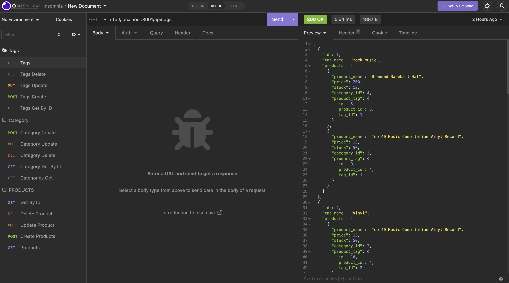

# E-Commerce

## Description

E-Commerce is a back end site that showcases the use of MySQL configured to use Sequalize and Express.js. The site consists of Products, Categories and Tags with the ability to view all, update, create, delete and get by Id. 

## Installation
> npm install  

## Usage
> mysql -u root -p  
> source db/schema.sql  
> exit  
> npm run seed  
> npm start  
> go to Insomnia to navigate within the database. 

## Screenshots/Video

Video presentation of application, click on a link -> [E-Commerce](https://drive.google.com/file/d/1Mh_7jIrjvnKWSFIxk6aaSefMqFsSHeXd/view)

Repo for app can be found at https://github.com/rroip/E-commerce_Back_End
